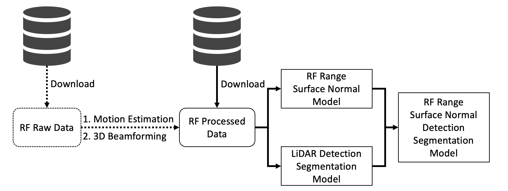
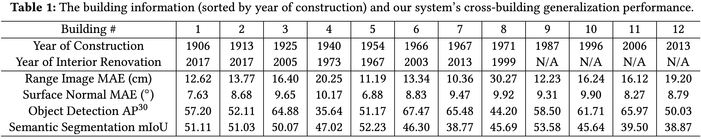

# PanoRadar [MobiCom'24 #279]

This is an official PyTorch implementation of PanoRadar for the following paper: <br/>

> **[Enabling Visual Recognition at Radio Frequency]()**  
> *ACM International Conference on Mobile Computing and Networking (**MobiCom**), 2024* 
>

---

## Overview


## Installation
Both Conda (recommended) and Docker environments are supported.

### Requirements
- Linux with Python ≥ 3.10
- Detectron2: follow [Detectron2 installation instructions](https://detectron2.readthedocs.io/tutorials/install.html).
- PyTorch ≥ 2.0.0 and TorchVision that matches the PyTorch installation.

### Conda environment (recommended)
```bash
conda create --name panoradar python=3.10
conda activate panoradar

pip install -r requirements.txt
pip install 'git+https://github.com/facebookresearch/detectron2.git'
```

### Docker (optional)
For Docker users, we also provide the dockerfile to build the image. You might need `sudo` access to run the commands.
```bash
# build the image
~/docker$ docker build -f docker/Dockerfile -t panoradar .  # don't omit the ending dot

# run a new container
~$ docker run -it --gpus all -v ~/PanoRadar:/mnt/PanoRadar --shm-size=4096M panoradar /bin/bash
```
## Artifact Evaluation Flow Chart


## Dataset
Our dataset includes two parts: the **RF Raw Data** (i.e., inputs of signal processing algorithms) and the **RF Processed Data** (i.e., inputs of machine learning models). Below is the description:
- RF Raw Data: We recorded the RF, LiDAR, and IMU data in 12 different buildings. All of them have timestamps and are synchronized. For each building, we collected the data when the robot was moving, while for the same trajectory, "static data" were also collected (the robot remained static at one location for about 5s before moving to the next one).

- RF Processed Data: This is the data for the machine learning pipeline. It contains the RF beamforming results (i.e., 3D RF Heatmaps), LiDAR range ground truth label, glass masks (i.e., binary segmentation label), semantic segmentation ground truth label, and object detection ground truth label. The RF beamforming results are from our signal processing algorithms (e.g., motion estimation and 3D beamforming). If the users want to skip the signal processing part and directly use the machine learning pipeline, they can directly download the RF Processed Data. The dataset includes a `exclude.txt` file that is used to get rid of a tiny portion of the corrupted data that contains packet loss.

**NOTE:** In all static folders, the RF Processed Data contains only selected static frames when the velocity is close to zero, while RF Raw Data contains both static and moving frames. We recommend you to use the RF processed data for the machine learning pipeline.

In the artifact evaluation PDF, you shall see **a link to a shared Google Drive** that contains both RF raw data and RF processed data. If you download the RF raw data (~1.3TB), we ask you to put in `./data/raw`. Similarily, RF processed data (~650GB) in `./data/processed`.

You can use the following script to unzip all the zip files with parallel processing.
```bash
ls *.zip | parallel -j0 unzip
```

## Signal Processing for Beamforming
The following scripts will run our signal processing scripts.

### Motion Estimation

This script will perform motion estimation for all trajectories. For each trajectory, it will output a `motion_output.npz` file in the folder for the trajectory. `folder_name` below is the name of the root folder that holds the raw RF data.

```bash
python run.py motion_estimation \
  --SP_root_name {folder_name}
```

Example:

```bash
python run.py motion_estimation \
  --SP_root_name ./data/raw
```
### Imaging (3D Beamforming) for One Frame

This script will visualize the signal processing result for a specific frame in a trajectory. The trajectory and frame is specified with the parameters `trajectory_name` and `frame_num` below. 

```bash
python run.py imaging \
  --SP_root_name {folder_name} \
  --traj_name {trajectory_name} \
  --frame_num {frame_num}
```

Example:

```bash
python run.py imaging \
  --SP_root_name raw_data \
  --traj_name building9_static/exp20230506-000 \
  --frame_num 5
```

An additional parameter `plot_out_path` can also be specified to save the imaging result as a `.png` file if you are running on a headless mode (e.g., on a server without a display).

```bash
python run.py imaging \
  --SP_root_name {folder_name} \
  --traj_name {trajectory_name} \
  --frame_num {frame_num} \
  --plot_out_path {path_to_save_image}
```

Example:

```bash
python run.py imaging \
  --SP_root_name ./data/raw \
  --traj_name building9_static/exp20230506-000 \
  --frame_num 5 \
  --plot_out_path . # To save in the root PanoRadar directory
```

### Imaging the Complete Dataset

We have also provided a script that will process the complete RF Raw Data to generate the complete dataset for the machine learning inputs. 

```bash
python run.py process_raw \
  --SP_root_name {folder_name} \
  --out_folder {out_folder_path}
```

Example:

```bash
python run.py process_raw \
  --SP_root_name ./data/raw \
  --out_folder ./data/processed_reproduce
```

## Training
**NOTE:** we currently have not tested the code for multi-GPU support. If you encounter any problems, please feel free to open an issue.

The following table records our leave-one-building-out (lobo) evaluation for our machine learning models.


**NOTE:** if you like to run evaluation and inference only, you can download the model configuration files and checkpoints from **the Google Drive link** in the artifact evaluation PDF. We ask you to put them under directory `./logs` and jump to Evaluation section. In the following, we provide step-by-step instructions to re-train the model for one building.

### Range and Surface Normal Training
Our model training follows a two-stage regime. In the first stage, we (pre)train the range estimation model with surface normal estimation as an auxiliary task to get LiDAR-comparable range estimation.
```bash
python train_net.py \
  --config-file configs/depth_sn.yaml \
  --num-gpus 1 \
  DATASETS.BASE_PATH "./processed" \
  DATASETS.TRAIN "('lobo_train_building1',)" \
  DATASETS.TEST "('lobo_test_building1',)" \
  OUTPUT_DIR "logs/mobicom24-lobo-building1-unet-bs8" \
  VIS_PERIOD -1
```

Set `VIS_PERIOD` to a positive integer (e.g., `5000` iterations) if you wish to visualize the training process (e.g., log images) in tensorboard.

### (Pre)training on LiDAR Data
Now we will train the object detection and semantic segmentation stage using the LiDAR range estimation data. This can be done by running the following script.
```bash
python train_net.py \
  --config-file configs/lidar.yaml \
  --num-gpus 1 \
  DATASETS.BASE_PATH "./processed" \
  DATASETS.TRAIN "('lobo_train_building1',)" \
  DATASETS.TEST "('lobo_test_building1',)" \
  OUTPUT_DIR "logs/mobicom24-lobo-building1-lidar-bs4" 
```
And the following script will stich the weights and save as `two_stage.pth` file in the same directory as the `config-file`. We can then use this file to initialize the weights for the two-stage training.
```bash
python prepare_params.py \
  --config-file logs/mobicom24-lobo-building1-unet-bs8/config.yaml \
  --lidar-config-file logs/mobicom24-lobo-building1-lidar-bs4/config.yaml
```

### Two-stage Training
The following script will jointly train the two-stage model by specifying the combined weights `MODEL.WEIGHTS`.
```bash
python train_net.py \
  --config-file configs/two_stage.yaml \
  --num-gpus 1 \
  DATASETS.BASE_PATH "./processed" \
  DATASETS.TRAIN "('lobo_train_building1',)" \
  DATASETS.TEST "('lobo_test_building1',)" \
  OUTPUT_DIR "logs/mobicom24-lobo-building1-two-stage-bs4" \
  MODEL.WEIGHTS "logs/mobicom24-lobo-building1-unet-bs8/two_stage.pth" \
  VIS_PERIOD -1
```
Similarily, set `VIS_PERIOD` to a positive number if you wish to visualize the training process.

## Evaluation
We can evaluate the model performance on the leave-one-building-out (lobo) test set by specifying the metrics (e.g., `depth`, `sn`, `seg`, `obj`) we want to compute. A `eval_results.txt` file will be saved in the same directory as the config file.
```bash
python eval.py \
  --metrics depth sn \
  --config-file logs/mobicom24-lobo-building1-unet-bs8/config.yaml 
```

```bash
python eval.py \
  --metrics depth sn seg obj \
  --config-file logs/mobicom24-lobo-building1-two-stage-bs4/config.yaml
```

## Inference
This will visualize all the data points in the test set and save it under the same directory as the config file. To visualize the depth and surface normal estimation model, run the following script and an folder named `vis_XX` will be created under the same directory as the config file.
```bash
python inference.py \
  --config-file logs/mobicom24-lobo-building1-unet-bs8/config.yaml
```

To visualize the two-stage model, run the following script:
```bash
python inference.py \
  --config-file logs/mobicom24-lobo-building1-two-stage-bs4/config.yaml 
```

## ML Runtime
The following script will run the model on a subset of the test set to extract FLOPs and inference speed.
```bash
python runtime.py \
  --config-file configs/depth_sn.yaml \
  --num-gpus 1
```

```bash
python runtime.py \
  --config-file configs/two_stage.yaml \
  --num-gpus 1
```

## License
The majority of PanoRadar is licensed under a [MIT License](LICENSE).

## Acknowledgement

The code is developed using detectron2 framework (https://github.com/facebookresearch/detectron2).
